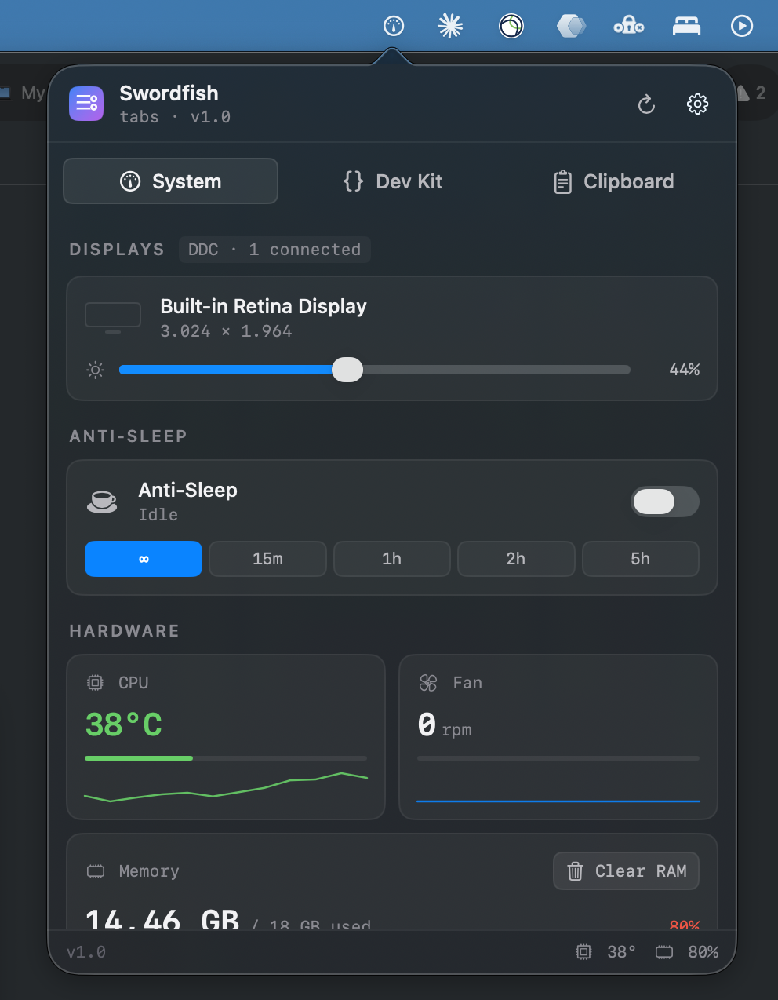
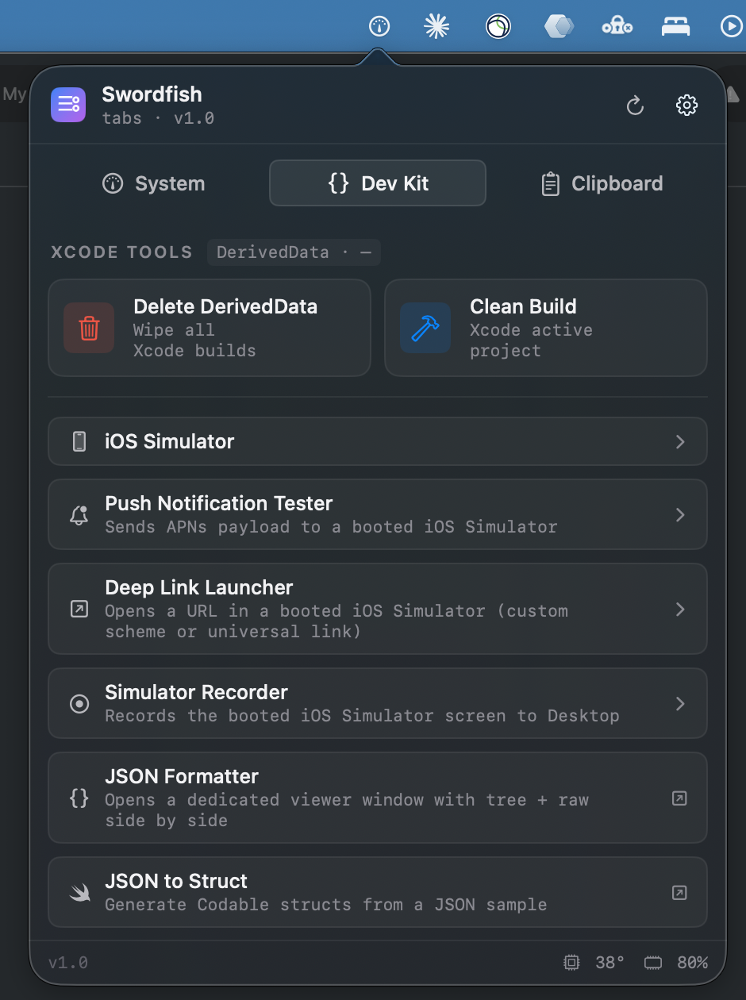
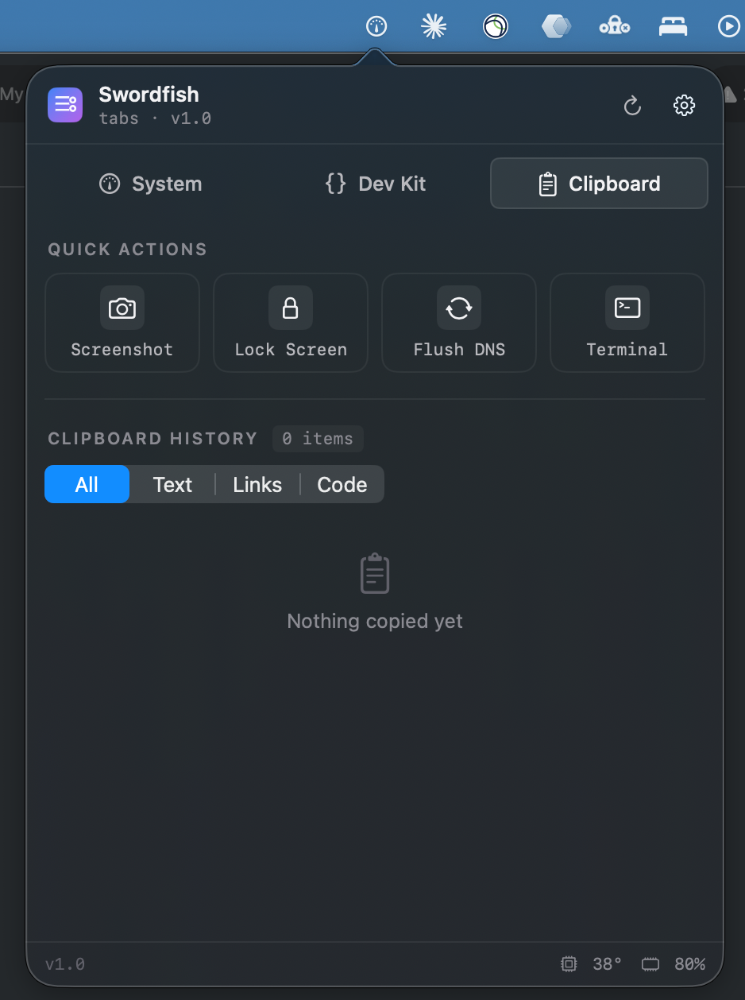

# Swordfish

> A macOS menu bar utility built for iOS and macOS engineers — Xcode housekeeping, Simulator controls, JSON tooling, and everyday system utilities in a single popover.

  

Swordfish is a native SwiftUI + AppKit menu bar app that consolidates the tools an iOS/macOS developer reaches for throughout the day: simctl-driven simulator controls, push & deep-link testing, DerivedData cleanup, a side-by-side JSON viewer, a JSON → Codable struct generator, plus system utilities (anti-sleep, display brightness, CPU/fan/memory/disk monitoring, clipboard history).

## Screenshots

<p align="center">
  
  
  
</p>

## Features

### Xcode & iOS Tooling
- **Delete DerivedData** — One-click wipe of `~/Library/Developer/Xcode/DerivedData` with a live size readout
- **Clean Build** — Sends "Clean Build Folder" to the active Xcode workspace via `osascript`
- **iOS Simulator** — List, boot, shutdown, and delete simulators from `xcrun simctl list`
- **Push Notification Tester** — Send APNs payloads to booted simulators with Simple / Rich / Silent presets
- **Deep Link Launcher** — Test custom URL schemes and universal links with recent-URL history
- **Simulator Recorder** — Records the simulator screen to MP4/HEVC on the Desktop with a live timer
- **Network Link Conditioner** — Throttle the Mac's default route (and therefore the iOS Simulator) via `dnctl` + `pfctl` (dummynet). Presets: Off / Edge / 3G / DSL / LTE / 5% Loss / 100% Loss, each tile shows target bandwidth + delay. First use writes `/etc/sudoers.d/swordfish-throttle` so later toggles run silently.
- **Color Picker** — System eyedropper (`NSColorSampler`), editable HEX field, recent-color history, and one-click copy rows for Swift (`UIColor` / `Color`), UIKit (RGBA), and CSS snippets

### JSON
- **JSON Viewer** — Dedicated window: raw editor on the left, a native tree (`List` + `OutlineGroup` = `NSOutlineView` under the hood) on the right. Paste, Format, Minify, Sort Keys, with parse-error line/column reporting.
- **JSON to Struct** — Generates Swift Codable structs from a JSON sample with toggles for `Codable` conformance and snake_case → camelCase mapping (auto-generated `CodingKeys`).

### System (popover)
- **Displays** — DDC/CI brightness slider for external monitors (`IOAVService`) plus built-in brightness (`DisplayServices.framework`)
- **Anti-Sleep** — Caffeine-style sleep prevention with an in-place duration picker (∞ / 15m / 1h / 2h / 5h), live countdown, and absolute end time
- **Hardware monitor** — CPU temperature (Apple Silicon IOHID sensors), fan RPM (SMC), 12-sample sparklines, threshold-colored bars
- **Memory & Storage** — Live stats via `host_statistics64` + `URL.resourceValues`, with app/wired/cache breakdown and a `purge`-backed Clear RAM

### Clipboard
- **History** — Last 20 items, pinnable, filterable (All/Text/Links/Code), click to re-copy
- **Quick Actions** — Screenshot, Lock Screen (⌃⌘Q via System Events), Flush DNS (admin prompt), Terminal

### App-level
- **Launch at Login** — Toggleable from the gear menu via `SMAppService`
- **Settings menu** — Quit + login toggle accessible from the popover header

## Installation

1. Download the latest `Swordfish.dmg` from [Releases](https://github.com/akkanferhan/Swordfish/releases)
2. Open the DMG and drag `Swordfish.app` to your `Applications` folder
3. First launch: right-click `Swordfish.app` → **Open** (Gatekeeper bypass for new downloads)
4. Grant permissions as features request them (see below)

## Permissions

Swordfish asks for these on first use. Everything is optional — features that require a missing permission will surface an inline error rather than fail silently.

| Permission | Used by |
|---|---|
| Automation → System Events | Lock Screen (⌃⌘Q shortcut synthesis) |
| Admin privileges (one-time auth prompt) | Flush DNS (`dscacheutil` + `killall -HUP mDNSResponder`) |
| Admin privileges (one-time, writes a sudoers entry) | Network Link Conditioner — grants `NOPASSWD` for `/usr/sbin/dnctl` and `/sbin/pfctl` so later toggles don't prompt. Removed when the helper is uninstalled from the ••• menu. |
| Screen Recording | Color Picker eyedropper, Quick Screenshot |

## Requirements

- **macOS 13.0** (Ventura) or later
- **Apple Silicon** for the full feature set — CPU temperature reading uses the Apple Silicon IOHID sensor surface
- **Intel Macs**: SMC-based temperatures, fan speeds, and all non-hardware features still work; the IOHID temperature path returns nil and the UI falls back accordingly

Xcode command-line tools (`xcrun simctl`) are required for Simulator features.

## Building from Source

Requirements:
- Xcode 15 or later
- Swift 5.9
- [XcodeGen](https://github.com/yonaskolb/XcodeGen): `brew install xcodegen`

```bash
git clone https://github.com/akkanferhan/Swordfish.git
cd Swordfish/Swordfish
xcodegen generate
open Swordfish.xcodeproj
```

Run via `⌘R`. First build takes ~30 seconds; incremental builds are fast.

Set `SWORDFISH_MOCK_SENSORS=1` in the scheme environment to use simulated CPU/fan values (useful when working on the hardware tiles without touching real sensors).

## Architecture

```
App/
  SwordfishApp.swift        — @main, NSApplicationDelegateAdaptor
  AppDelegate.swift         — NSStatusItem + NSPopover owner, PopoverController
  AppEnvironment.swift      — dependency wiring

Services/                   — ObservableObjects, one per feature domain
  SystemMonitor.swift       — 2s polling of all hardware + memory + disk
  HardwareSensors.swift     — IOHIDEventSystemClient + SMC wrappers
  MemoryStats.swift         — host_statistics64 wrapper (app / wired / cache)
  DiskStats.swift           — URL.resourceValues-based volume capacity
  DisplayController.swift   — CGDisplay enumeration, brightness debounce
  DisplayBrightness.swift   — DisplayServices (dlopen) + IOAVService DDC/CI
  CaffeineService.swift     — IOPMAssertion-based anti-sleep
  ClipboardService.swift    — NSPasteboard changeCount polling
  SimulatorService.swift    — xcrun simctl wrapper
  NetworkThrottleService.swift — dnctl + pfctl dummynet, sudoers helper
  LoginItemManager.swift    — SMAppService
  JSONToSwift.swift         — recursive Swift struct generator
  DevToolsState.swift       — shared state across DevKit tools (picked color, etc.)

Views/
  Popover/                  — status-item popover shell
  SystemHub/                — displays, anti-sleep, hardware tiles
  DevKit/                   — Xcode tools + simulator + launch rows
  Productivity/             — clipboard + quick actions
  JSONViewer/               — standalone JSON Viewer window
  JSONToSwift/              — standalone Struct Generator window
  Shared/                   — ExpandableSection, LaunchSection, Sparkline, Badge

DesignSystem/               — Theme, Typography, Spacing, Motion, Radius

Utilities/                  — ProcessRunner, AppVersion (Bundle helpers)
```

Services are the source of truth. Views never talk to IOKit or shell directly — they go through the corresponding service, which makes mocking and unit testing straightforward.

## Private APIs

Swordfish uses a handful of private / undocumented Apple APIs because there is no public alternative:

- **`DisplayServices.framework`** — built-in display brightness control (`DisplayServicesSetBrightness` / `DisplayServicesGetBrightness`). Loaded via `dlopen`.
- **`IOAVService`** (+ `IOAVServiceWriteI2C`) — DDC/CI VCP writes to external monitors.
- **`IOHIDEventSystemClient`** — Apple Silicon PMU temperature sensors (matched via `0xFF00` usage page).

These are declared with `@_silgen_name` and called directly. Using them **precludes Mac App Store distribution** — which is a conscious tradeoff. The app targets developers who install tools from GitHub, and the public alternatives would gut the app's value.

Inspired patterns: [MonitorControl](https://github.com/MonitorControl/MonitorControl) for DDC, [Stats](https://github.com/exelban/stats) for IOHID sensor enumeration.

## Development Workflow

Swordfish follows a `master` / `develop` / `feature/*` branching model:

- `master` holds only released builds (tagged `v*`)
- `develop` is the integration branch — every feature lands here via a merge commit (`--no-ff`)
- Feature work branches off `develop` as `feature/<slug>` and merges back via PR

Browse `git log --graph develop` to see how each feature was built and integrated.

## License

[MIT](LICENSE) — do whatever you want, no warranty.
