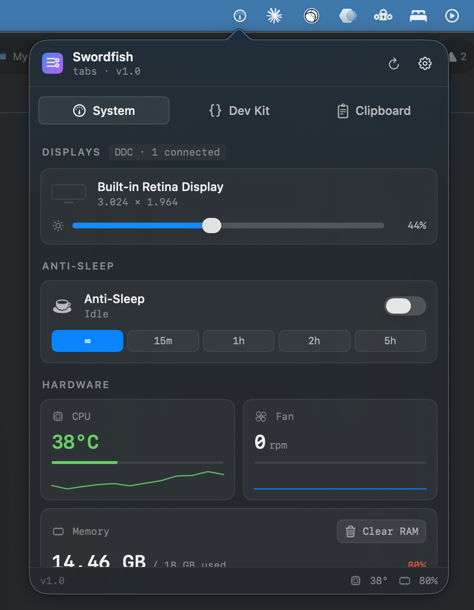
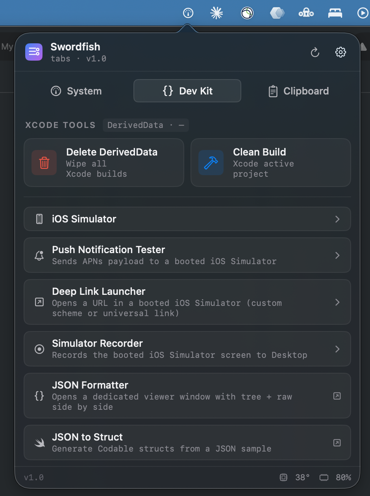
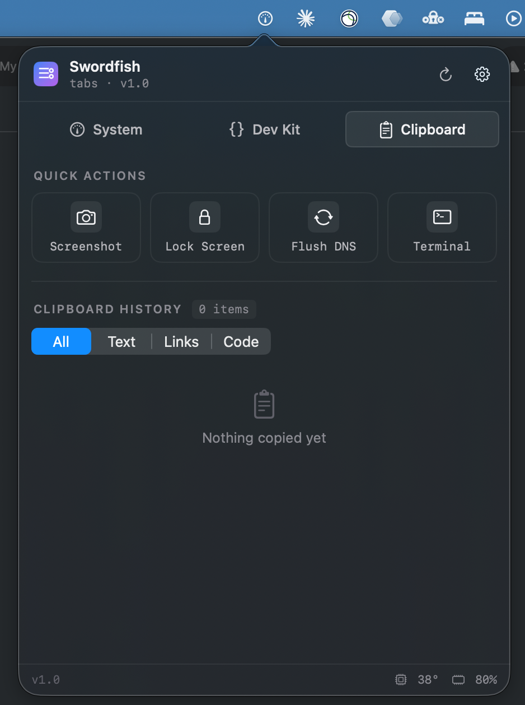

# Swordfish

> A macOS menu bar utility built for iOS and macOS engineers — Xcode housekeeping, Simulator controls, JSON tooling, and everyday system utilities in a single popover.

  

Swordfish is a native SwiftUI + AppKit menu bar app that consolidates the tools an iOS/macOS developer reaches for throughout the day: simctl-driven simulator controls, push & deep-link testing, DerivedData cleanup, a side-by-side JSON viewer, a JSON → Codable struct generator, plus system utilities (anti-sleep, display brightness, CPU/fan/memory/disk monitoring, clipboard history).

## Screenshots

<p align="center">
  
  
  
</p>

## Features

### Xcode & iOS Tooling
- **Delete DerivedData** — One-click wipe of `~/Library/Developer/Xcode/DerivedData` with a live size readout
- **Active Xcode switcher** — Lists every installed Xcode and switches `xcode-select` (admin prompt) when more than one is present
- **Disk Cleanup** — Sizes and selectively deletes DerivedData per project, simulator runtimes (with last-used dates, via `simctl runtime delete`), iOS/watchOS/tvOS DeviceSupport per version, Archives, SPM / Xcode / CoreSimulator caches, plus `simctl delete unavailable`
- **Build Times** — Reads Xcode's build manifests in DerivedData: durations per scheme with a trend sparkline, and a notification when a build finishes (minimum duration and "only while Xcode is in the background" configurable; slower-than-usual builds are flagged)
- **Xcode Releases & Runtimes** — Latest Xcode releases (installed ones marked) with release notes, `.xip` download or one-click install through the `xcodes` CLI, and simulator runtime downloads via `xcodebuild -downloadPlatform`
- **Crash Symbolicator** — Drop a `.ips` or `.crash` report; dSYMs are found by UUID through Spotlight and frames resolved with `atos`. Includes a "find dSYM by UUID" lookup
- **Clean Build** — Sends "Clean Build Folder" to the active Xcode workspace via `osascript`
- **iOS Simulator** — List, boot, shutdown, delete, create (runtime + device type), clone, rename and erase simulators
- **Simulator Toolbox** — Everyday `simctl` helpers for a booted simulator in one place:
  - **Status Bar Override** — App Store screenshot mode (9:41, full battery & signal) with editable time, battery level/state, and network indicator (`simctl status_bar`)
  - **Permission Manager** — Grant / revoke / reset privacy services (Location, Photos, Contacts, Microphone, …) per installed app (`simctl privacy`)
  - **Location Simulation** — City presets or custom lat/lon, plus routes: preset or custom waypoints / GPX import played at walk, run, bike, city or highway speed (`simctl location start`)
  - **Add Media** — Drag & drop images/videos (or a file picker) straight into the simulator's Photos library (`simctl addmedia`)
  - **Apps** — List installed user apps; install a `.app` (drag & drop), launch / terminate, launch in any of the app's languages or with pseudo-localization (double-length, right-to-left, unlocalized-string highlighting), edit UserDefaults in a dedicated editor, open SQLite / Core Data / SwiftData stores, erase app data, uninstall
  - **Device** — Dynamic Type size (XS…AX5), Increase Contrast, Face ID / Touch ID enroll + match / no-match, keychain reset, Mac ↔ Simulator pasteboard sync, and trusting a proxy root CA (Proxyman / Charles / mitmproxy)
  - **Quick actions** — One-click simulator screenshot to Desktop (`simctl io screenshot`) and Light/Dark appearance toggle (`simctl ui appearance`)
- **Simulator Logs** — Dedicated window streaming a booted simulator's unified log (`simctl spawn … log stream`), filtered by process / subsystem / level, with search, errors-only, and auto-scroll
- **Physical Devices** — Paired iPhones/iPads via `devicectl`: install `.app` / `.ipa` (drag & drop), launch by bundle ID, screenshot and crash-log export to the Desktop
- **Signing & Profiles** — Provisioning profiles (type, bundle ID, team, devices, entitlements, expiry) cross-checked against the signing certificates in your keychain; trash expired profiles in one click
- **Push Notification Tester** — Send payloads to a booted simulator, or to a real device through APNs (token-based `.p8` auth, sandbox / production, readable error reasons); saved payload library and "resend last"
- **Deep Link Launcher** — Test custom URL schemes and universal links with recent-URL history
- **Universal Link Validator** — Fetches a domain's `apple-app-site-association` from your server and Apple's CDN, checks status / content type / size / redirects / JSON / app IDs, and tells you which app (if any) a given URL opens and by which rule
- **Simulator Recorder** — Records the simulator screen to MP4/HEVC on the Desktop with a live timer; turn any recording into a looping GIF; toggle Simulator touch indicators
- **Design Overlay** — Lays a design export semi-transparently over the Simulator window (click-through), with a layout grid, snap-to-Simulator and 1 pt nudging
- **Physical Devices** — also opens deep links / universal links in an app on the device (`devicectl … --payload-url`)
- **App Store Connect** — Recent builds and their processing state through the App Store Connect API, with a notification when a build is ready in TestFlight
- **Apple Developer Status** — APNs, App Store Connect, TestFlight, notary service… current incidents from Apple's system status feed
- **Network Lab** — A local proxy that logs HTTP requests in full and HTTPS as host + bytes (optionally routing the Mac and Simulators through it), and a mock API server with per-route method, path patterns, status, delay, headers and body
- **Network Link Conditioner** — Throttle the Mac's default route (and therefore the iOS Simulator) via `dnctl` + `pfctl` (dummynet). Presets: Off / Edge / 3G / DSL / LTE / 5% Loss / 100% Loss, each tile shows target bandwidth + delay. First use writes `/etc/sudoers.d/swordfish-throttle` so later toggles run silently.
- **Color Picker** — System eyedropper (`NSColorSampler`), editable HEX field, recent-color history, and one-click copy rows for Swift (`UIColor` / `Color`), UIKit (RGBA), and CSS snippets

### JSON
- **JSON Viewer** — Dedicated window: raw editor on the left, a native tree (`List` + `OutlineGroup` = `NSOutlineView` under the hood) on the right. Paste, Format, Minify, Sort Keys, with parse-error line/column reporting.
- **JSON to Struct** — Generates Swift Codable structs from a JSON sample with toggles for `Codable` conformance and snake_case → camelCase mapping (auto-generated `CodingKeys`).

### Dev Utilities (window)
- JWT decoder (with `exp` / `iat` readout), Unix ↔ ISO 8601 timestamps, Base64 / base64url, URL encode / decode + component breakdown, cURL → `URLRequest` code (and request → cURL), UUID generator, Plist ↔ JSON, MD5 / SHA hashes — all local
- **SF Symbols** browser (search, rendering modes, copy name / SwiftUI / UIKit), **App Icon** generator (one 1024 px image → `AppIcon.appiconset` for iOS / macOS / watchOS), **Localization Check** (per-language coverage and missing keys of every `.xcstrings` in a project, CSV export)
- **Color Picker** also shows WCAG contrast against white, black or any color, with AA / AAA results

### System (popover)
- **Displays** — DDC/CI brightness slider for external monitors (`IOAVService`) plus built-in brightness (`DisplayServices.framework`)
- **Anti-Sleep** — Caffeine-style sleep prevention with an in-place duration picker (∞ / 15m / 1h / 2h / 5h), live countdown, and absolute end time
- **Lid-Closed Mode** — Keeps the Mac awake even with the lid closed (`pmset -a disablesleep`). One-time admin prompt writes a sudoers entry scoped to exactly the two pmset commands; sleep is restored automatically when Swordfish quits.
- **Quick Toggles** — Dark Mode, show hidden files in Finder, and default audio output / input device pickers (CoreAudio)
- **Hardware monitor** — CPU temperature (Apple Silicon IOHID sensors), fan RPM (SMC), 12-sample sparklines, threshold-colored bars, plus a thermal-pressure badge when macOS starts throttling
- **CPU / GPU load** — Overall and per-core CPU utilisation (`host_processor_info`) and GPU utilisation (IOAccelerator performance statistics)
- **Memory & Storage** — Live stats via `host_statistics64` + `URL.resourceValues`, with app/wired/cache/free breakdown
- **Network** — Live download / upload rate with sparklines, active interface, local IP and VPN indicator
- **Battery** — Charge, time remaining, health (full-charge vs. design capacity), cycle count, temperature and adapter wattage; connected AirPods / Magic accessories' battery levels
- **Processes** — Top processes by CPU or memory with quit / force quit, a dev-tools memory summary, listening TCP ports (open in browser, copy, quit the owner), and one-click restarts for SourceKit, CoreSimulator and the Xcode build service

### Clipboard
- **History** — Text, links, code, images and files; searchable, pinnable, filterable (All/Text/Links/Code/Media), shows the source app; kept across launches (20–500 items, configurable)
- **Privacy** — Copies marked private by password managers (`org.nspasteboard.ConcealedType` / `TransientType`) are never recorded; per-app exclusion list (1Password, Bitwarden, Keychain Access… by default); tokens and API keys (JWT, `sk-…`, `ghp_…`, `AKIA…`, PEM keys) are masked, kept in memory only, and deleted after 2 minutes
- **Smart actions** — JSON → JSON Viewer, JWT → decoder, Unix timestamp → date, Base64 → decoded text, deep link → open in booted Simulator, HEX → color swatch + SwiftUI / UIColor; plus transforms (trim, case, camelCase / snake_case, sort / dedupe lines, JSON escape / unescape)
- **Quick paste panel** — Global hotkey (⌃⌘V by default, configurable) opens a Spotlight-style history panel over any app: search, ↑↓, ↩ to paste (with Accessibility permission), ⌘1–9 quick pick
- **Quick Actions** — Screenshot, Lock Screen (⌃⌘Q via System Events), Flush DNS (admin prompt), Terminal

### App-level
- **Settings window** (gear menu → Settings…, ⌘,) —
  - **General**: in-app language picker (System Default / English / Türkçe, with one-click relaunch), Launch at Login (`SMAppService`), version info
  - **Monitoring**: optional live value next to the menu bar icon (CPU temperature / load, memory, network speed) and notifications for CPU temperature, low disk space, critical memory pressure and thermal throttling (30-minute cooldown per alert)
  - **Developer Keys**: APNs and App Store Connect API keys (IDs in preferences, `.p8` private keys in the Keychain)
  - **Permissions**: live status of everything features depend on — Screen Recording, Automation (System Events), the two sudoers helpers (Lid-Closed Mode, Network Link Conditioner), and Xcode Developer Tools (`simctl`) — with Request / Open System Settings shortcuts and a copyable `xcode-select` fix when developer tools are missing
- **Launch at Login** — Also toggleable directly from the gear menu
- **Localization** — English, Turkish, Spanish, French, Serbian (Cyrillic & Latin), and Japanese via a String Catalog (`Localizable.xcstrings`); follows the system language or the in-app override

## Installation

1. Download the latest `Swordfish.dmg` from [Releases](https://github.com/akkanferhan/Swordfish/releases)
2. Open the DMG and drag `Swordfish.app` to your `Applications` folder
3. First launch: right-click `Swordfish.app` → **Open** (Gatekeeper bypass for new downloads)
4. Grant permissions as features request them (see below)

## Permissions

Swordfish asks for these on first use. Everything is optional — features that require a missing permission will surface an inline error rather than fail silently.

| Permission | Used by |
|---|---|
| Automation → System Events | Lock Screen (⌃⌘Q shortcut synthesis) |
| Admin privileges (one-time auth prompt) | Flush DNS (`dscacheutil` + `killall -HUP mDNSResponder`) |
| Admin privileges (one-time, writes a sudoers entry) | Network Link Conditioner — grants `NOPASSWD` for `/usr/sbin/dnctl` and `/sbin/pfctl` so later toggles don't prompt. Removed when the helper is uninstalled from the ••• menu. |
| Admin privileges (one-time, writes a sudoers entry) | Lid-Closed Mode — grants `NOPASSWD` for exactly `pmset -a disablesleep 1/0`. Removed via right-click → "Remove helper & restore sleep". |
| Screen Recording | Color Picker eyedropper, Quick Screenshot |

## Requirements

- **macOS 13.0** (Ventura) or later
- **Apple Silicon** for the full feature set — CPU temperature reading uses the Apple Silicon IOHID sensor surface
- **Intel Macs**: SMC-based temperatures, fan speeds, and all non-hardware features still work; the IOHID temperature path returns nil and the UI falls back accordingly

Xcode command-line tools (`xcrun simctl`) are required for Simulator features.

## Building from Source

Requirements:
- Xcode 15 or later
- Swift 5.9
- [XcodeGen](https://github.com/yonaskolb/XcodeGen): `brew install xcodegen`

```bash
git clone https://github.com/akkanferhan/Swordfish.git
cd Swordfish/Swordfish
xcodegen generate
open Swordfish.xcodeproj
```

Run via `⌘R`. First build takes ~30 seconds; incremental builds are fast.

Set `SWORDFISH_MOCK_SENSORS=1` in the scheme environment to use simulated CPU/fan values (useful when working on the hardware tiles without touching real sensors).

## Architecture

```
App/
  SwordfishApp.swift        — @main, NSApplicationDelegateAdaptor
  AppDelegate.swift         — NSStatusItem + NSPopover owner, PopoverController
  AppEnvironment.swift      — dependency wiring

Services/                   — ObservableObjects, one per feature domain
  SystemMonitor.swift       — 2s polling of all hardware + memory + disk
  HardwareSensors.swift     — IOHIDEventSystemClient + SMC wrappers
  MemoryStats.swift         — host_statistics64 wrapper (app / wired / cache)
  DiskStats.swift           — URL.resourceValues-based volume capacity
  DisplayController.swift   — CGDisplay enumeration, brightness debounce
  DisplayBrightness.swift   — DisplayServices (dlopen) + IOAVService DDC/CI
  CaffeineService.swift     — IOPMAssertion-based anti-sleep
  ClipboardService.swift    — NSPasteboard changeCount polling
  SimulatorService.swift    — xcrun simctl wrapper
  NetworkThrottleService.swift — dnctl + pfctl dummynet, sudoers helper
  LoginItemManager.swift    — SMAppService
  JSONToSwift.swift         — recursive Swift struct generator
  DevToolsState.swift       — shared state across DevKit tools (picked color, etc.)

Views/
  Popover/                  — status-item popover shell
  SystemHub/                — displays, anti-sleep, hardware tiles
  DevKit/                   — Xcode tools + simulator + launch rows
  Productivity/             — clipboard + quick actions
  JSONViewer/               — standalone JSON Viewer window
  JSONToSwift/              — standalone Struct Generator window
  Shared/                   — ExpandableSection, LaunchSection, Sparkline, Badge

DesignSystem/               — Theme, Typography, Spacing, Motion, Radius

Utilities/                  — ProcessRunner, AppVersion (Bundle helpers)
```

Services are the source of truth. Views never talk to IOKit or shell directly — they go through the corresponding service, which makes mocking and unit testing straightforward.

## Private APIs

Swordfish uses a handful of private / undocumented Apple APIs because there is no public alternative:

- **`DisplayServices.framework`** — built-in display brightness control (`DisplayServicesSetBrightness` / `DisplayServicesGetBrightness`). Loaded via `dlopen`.
- **`IOAVService`** (+ `IOAVServiceWriteI2C`) — DDC/CI VCP writes to external monitors.
- **`IOHIDEventSystemClient`** — Apple Silicon PMU temperature sensors (matched via `0xFF00` usage page).

These are declared with `@_silgen_name` and called directly. Using them **precludes Mac App Store distribution** — which is a conscious tradeoff. The app targets developers who install tools from GitHub, and the public alternatives would gut the app's value.

Inspired patterns: [MonitorControl](https://github.com/MonitorControl/MonitorControl) for DDC, [Stats](https://github.com/exelban/stats) for IOHID sensor enumeration.

## Development Workflow

Swordfish follows a `master` / `develop` / `feature/*` branching model:

- `master` holds only released builds (tagged `v*`)
- `develop` is the integration branch — every feature lands here via a merge commit (`--no-ff`)
- Feature work branches off `develop` as `feature/<slug>` and merges back via PR

Browse `git log --graph develop` to see how each feature was built and integrated.

## License

[MIT](LICENSE) — do whatever you want, no warranty.
